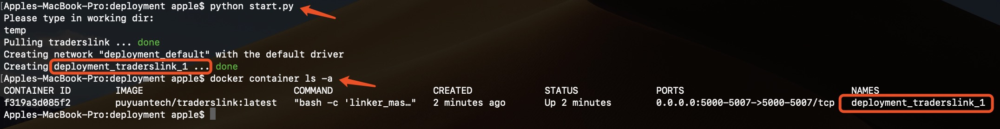

# Traderslink 新手指引

## 重要概念

### 产品架构	
Traderslink 将服务端的各种功能封装成模块，主要的模块包括交易路由、行情路由、交易网关、行情网关、订单管理模块、仓位管理模块等，每个模块有唯一标识：fist_name。  


* 交易网关（TRADE_GATEWAY）  
服务端的一个模块，负责与交易柜台连通，处理委托的请求、响应、回报。一个客户端可以与多个交易网关对应，一个交易网关负责对应一个交易柜台。交易网关负责处理以下流程：
		
* 行情网关（MARKET_GATEWAY）  
行情网关负责与券商柜台通信，订阅和分发行情。
		
* 交易路由（TRADE_ROUTER）  
交易路由负责客户端与交易网关之间的交易相关消息的转发。
	
* 行情路由（MARKET_ROUTER）  
行情路由负责客户端与交易网关之间行情相关消息的转发。

* 总控（MASTER）  
负责调度和管理所有模块。

### 部署方式
以上这些应用程序及其依赖打包在 Docker image 里，用户可以通过 puyuantech/traderslink 这个 image 文件，根据需求生成不同的容器的实例。

## 安装部署

### 准备工作
1. 从以下地址下载最新版 Docker: https://www.docker.com/ ，安装并启动Docker服务。

### 下载 Traderslink 并安装

1. 获取安装文件
    ```
    git clone https://github.com/puyuantech/deployment.git
    ```
2. 填写交易账号  
    在 puyuan.yml 的 "accounts" 标签下填写 CTP 账号。
    - 模拟账户，请申请 SimNow 仿真交易账号并填入 user_id 和 password（SimNow 注册后需要修改一次密码，第二天账号才能正常交易）。
    - 实盘账户，需要将 broker_id，front_uri 等修改为实盘的配置，并填入正确的 user_id 和 password。

    交易系统需要使用 5000~5007 端口，请预留这些端口以便系统正常使用。

### 启动与停止 Traderslink 服务

1. 打开命令行终端，执行 start.py
    ```bash
    cd traderslink
    python start.py
    ```
    通过以上命令，初始交易系统、获取最新 Docker image、启动 Docker。

2. 可用以下命令查看当前的 Docker 列表，以验证 Docker 是否正确启动.
    ```bash
    docker container ls -a
    ```
    如果 Docker 正确启动，交易系统服务就可以正常使用了。

3. 进入 Docker 查看系统运行状态
    ```bash
    docker exec -it dtl-main bash
    gun status
    ```
    将其中的 dtl-main 替换为当前启动的 Docker 名称，当前的 Docker 名称如下图所示
    
    
4. 关闭 Docker，停止交易系统
    ```bash
    docker-compose down
    ```

## 编写策略并开始交易
### 运行样例策略
1. 使用 pip 下载 Traderslink 的 Python SDK
    ```bash
    pip install tlclient
    ```
2. 运行策略  
在 Traderslink 服务启动后，进入示例策略文件夹，并运行下面的策略示例（示例策略依赖于 numpy 和 pandas 软件包，请预先安装），日志文件保存在 /shared/log/ 文件夹中，如果不存在请先创建
    ```bash
    cd traderslink/sample_strategy
    python doublema.py
    ```
3. 编写策略  
可以按照上述示例编写自己的策略并实验。

### Python SDK 功能
Traderslink Python SDK 目前提供了如下接口，详细用法请查看相关文档
* 普通委托
* 算法委托（Twap）
* 订阅行情
* 查询持仓
* 查询资金
* 查询委托
* 查询所有未成交委托
* 撤销所有未成交委托
* 网关心跳监测
* 网关连接状况监测
* 消息提醒


